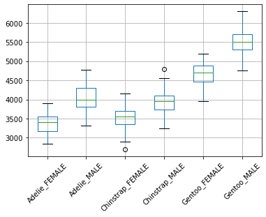
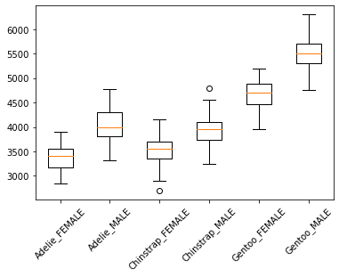
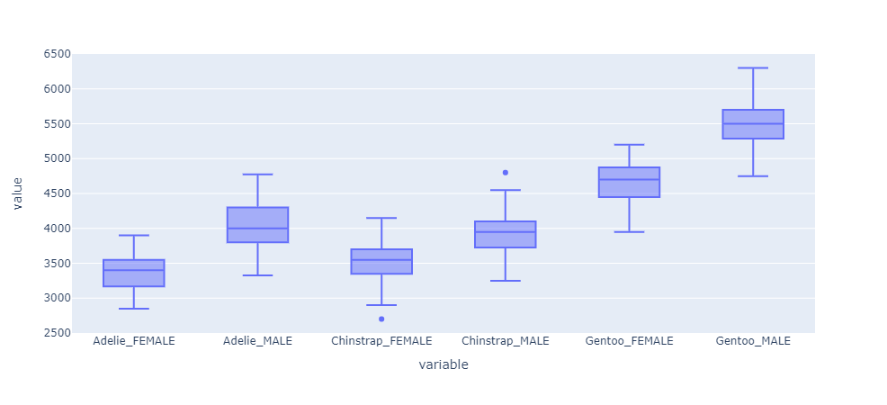
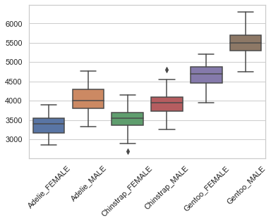
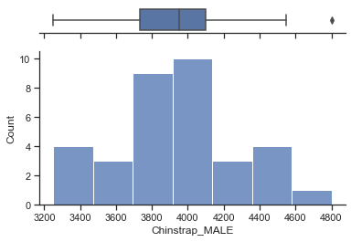

# python-boxplots

Author:  Erin James Wills, ejw.data@gmail.com  

<cite>Photo by [User:Schutz](https://en.wikipedia.org/wiki/Box_plot#/media/File:Michelsonmorley-boxplot.svg) on [Wikipedia](https://en.wikipedia.org/wiki/Box_plot)</cite>  

 

## Overview  

  

This repo was created to test the different python box plot packages and determine the different requirements needed and options available with each package.  I am also using the penguin dataset and pandas to manipulate my data into an initial standard form.   

Also included is a tutorial notebook explaining how box plots work with examples.

 

## Contents  
1. Penguin Dataset Manipulation (pandas) 
2. Pandas Box Plots
3. Matplotlib Box Plots
4. Plotly Box Plots
5. Seaborn Box Plots
6. Bokeh Box Plots  

 

## Technologies    
*  Python
*  Pandas
*  Matplotlib
*  Multiple Other Plotting Packages

 

## Data Source
The data for this example comes from Kaggle: [Palmer Archipelago (Antartica) penguin data](https://www.kaggle.com/datasets/parulpandey/palmer-archipelago-antarctica-penguin-data?resource=download&select=penguins_size.csv).  For convenience, the two data files have been added to the `data` folder. 

 

## Setup and Installation  
1. Environment needs the following:  
    *  Python 3.6+  
    *  pandas  
    *  matplotlib.pyplot
    *  plotly.express
    *  plotly.offline
    *  seaborn
    *  bokeh.plotting
1. Activate your environment
1. Clone the repo to your local machine
1. Start Jupyter Notebook within the environment from the repo
1. Run `boxplot-comprisons.ipynb` to see comparison of box plots.
1. Run `boxplot-whisker-explanation.ipynb` to learn about box plot meaning and design

   

## Review  

Overall, all the packages were very manageable and in many cases much easier to implement than some javascript equivalents.  Many of the packages utilize matplotlib in the background so in a final evaluation, I would suggest becoming very familiar with that package since it increase your ability to customize the other packages.    

The easiest package to use is pandas.  There is very little data manipulated needed if your data is already in dataframe format.  Simple plots can be made with ease and adanced plotting will require knowing some matplotlib.  

Matplotlib is also easy to use in a similar way as pandas but documentation is much more thorough with examples of how to manipulate the charts and create advanced versions.  Some of the more advanced plots can also be created in pandas and mixing in some matplotlib commands but this involves a bit of a learning curve to understand how pandas and matplotlib work together.  It is very doable but often requires some experimenation.  I would often suggest using pure matplotlib for advanced plots since the documentation is well organized.  

Plotly is a very nice package that requires surprisingly very little coding.  It allows for the use of dataframes and the only learning curve is learning intially how to setup the package to display in a notebook or as a html document.  This is due to changes in plotly over the past few years and transitioning to different versions of python.  Overall it is a very nice plotting package that has a different style.  It is very conducive to web based applications and probably less ideal for print-based applications. I don't think customization will be done with any matplotlib based on how plotly is setup.  The plotly style is also very popular with web applications since plotly has a well known javascript version.   

Seaborn is also a very nice package that can be modified with matplotlib.  It has it's own style that is different than the other packages but is still very easly to use with dataframes.  If I needed a very specific plot (not a standard plot) then I would first look at matplotlib and then I would compare with what seaborn offers.  Between the two packages, I think I would find a template that would work for my needs or only need modest customizations.  

Bokeh was not as user friendly as the other packages when specifically trying to make a box plot.  I would assume that the package would have a fairly automate method for making a this standard plot but I needed to calculate all the subparts of the plot to make it work.  I thought this was overkill since I don't think I would ever need to customize a box plot in that detail.  It also did not display in my jupyter notebook inline so that is a major detraction to using it since users will not be able to see the output on github when previewing the notebook.  

 

## Examples  

<figure>

<figcaption>Fig.1 - Pandas Box Plot</figcaption>
</figure>

<figure>

<figcaption>Fig.2 - Matplotlib Box Plot</figcaption>
</figure>

<figure>

<figcaption>Fig.3 - Python Plotly Express Box Plot</figcaption>
</figure>

<figure>

<figcaption>Fig.4 - Seaborn Box Plot</figcaption>
</figure>

<figure>

<figcaption>Fig.1 - Seaborn Advanced Box Plot</figcaption>
</figure>